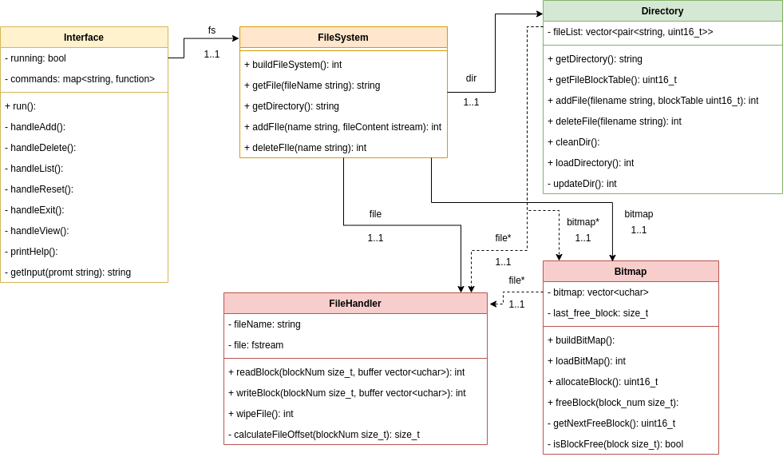
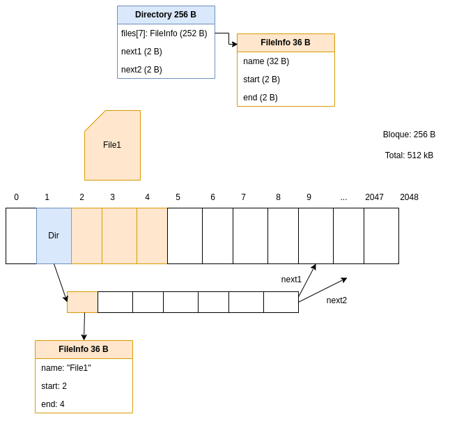
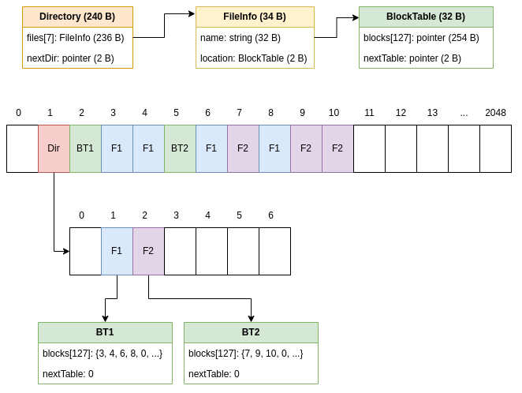

# File System

## Requerimientos

- Una interfaz que pueda:
   - realizar consultas al directorio
   - listar el bloque donde se encuentra la tabla del archivo
   - agregar archivos por nombre
   - eliminar archivos por nombre
   - reiniciar el sistema de archivos
   - consultar los contenidos de un archivo
- Un programa de file system que pueda
   - leer el file system si existe
   - ofrecer una vista del directorio
   - retornar un archivo solicitado
   - agregar archivos al file system
   - eliminar archivos del file system

La parte de agregar y eliminar se no se implementa el la interfaz, solo en el
modelo de datos.

## Diagrama de Clases

Para detallar el programa, se crea el siguiente diagrama de clases que ilustra
los componentes del programa, cuáles son sus responsabilidades y sus relaciones.

### Interface

Es una clase para poder probar el file system desde la terminal.
Provee una funcionalidad básica de menú para escoger entre
las distintas funcionalidades que ofrece el file system. También
se encarga del formato de la información para que el usuario
pueda hacer uso directo del FileSystem. La clase FileSystem
se encarga de encontrar si el archivo existe o si debe
crear uno nuevo, por lo que el interfaz es, solamente eso,
un interfaz.

### FileSystem

Es la clase principal del programa. Se encarga de integrar
todas las funcionalidades de las clases para proveer un interfaz
que permita agregar archivos, eliminarlos y poder acceder tanto
al directorio como a los archivos. Tiene, junto a las demás clases,
la capacidad de cargar el sistema de archivos de un archivo existente,
siempre y cuando cumpla con el formato establecido.

### Directory

La clase Directory se encarga de administrar la metadata de los
archivos en un lugar. Como el directorio crece dinámicamente,
la clase se encarga de hacer crecer y disminuír el directorio.
Tiene acceso al bitmap para poder solicitar y liberar bloques y
tiene acceso al FileHandler para poder leer y escribir de esos
bloques.

El primer bloque se ubica en la posición 1. Cuando crece, asigna
el siguiente bloque disponible (funcionalidad del bitmap).

### Bitmap

Para poder llevar un registro de los bloques que están ocupados
y los que están libres, se agregó un bitmap. El bitmap tiene
un puntero al FileHandler, ya que requiere poder leer del archivo
el bitmap actual y poder actualizarlo (escribir). Para el
usuario, está la funcionalidad de asignar memoria y de liberarla,
de la misma manera que se hace en los lenguajes de C y C++.

El bitmap ocupa un único bloque (2) y cuenta con suficientes
bits para poder llevar el registro de los 2048 bloques
del archivo.

### FileHandler

La clase encargada de la manipulación del archivo. Provee un tipo de interfaz
para realizar lecturas y escrituras en el archivo por bloques. Es la única clase que interactúa directamente con
el archivo.

## Versión 1. Almacenamiento continuo

### Especificaciones

Los bloques se asignan inicializados en 0.

Se utiliza memoria continua.

El bloque 0 se deja vacío y se utiliza para indicar un puntero nulo.

El directorio inicial se ubica en el bloque 1.

Almacenamiento: medio megabyte = 512 kB

Bloques de 256 bytes

2048 bloques en total

Con 2 bytes basta para indexar el bloque más grande
- (2048 < 65536 = 2^16)

### Directorio
Se diseñó la siguiente estructura de datos para almacenar el directorio.

Un bloque que contiene una tabla para guardar información de archivos que cada uno suma 36 B en total.
- nombre (32 B)
- bloque de inicio (2B)
- bloque final (2B)

Con 7 directorios se ocupa 252 B. Quedan 4 bytes libres que se pueden usar como punteros a otras estructuras iguales de ser necesarias. Esto le permite al directorio crecer dinámicamente.

Si no hay otros directorios, apuntan al bloque 0.

## Versión 2. Almacenamiento dinámico

Se modifica la versión original para que pueda administrar la memoria de forma
dinámica.

Los principales cambios son los siguientes:

- El file ya no tendrá un puntero al final y al principio, ya que no está
necesariamente contínuo. En su lugar, tendrá un puntero a un bloque que almacena
todos los bloques a los que pertenece ese archivo. En el último puntero (dos bytes
finales), el bloque almacena un puntero a otro archivo con más punteros. En el
momento en que algún puntero llegue a 0, te toma como el final del archivo.

- El directorio ahora tendrá archivos de 34 bytes, no 36. Igual solo tendrá 7
y usará 2 bytes de los restantes para almacenar un puntero a otra tabla del mismo
índole. Hay un desperdicio de 16 bytes en el bloque.

## Versión 3. BitMap

En la implementación, se encontró un problema para el file system. El sistema
podía saber si un bloque estaba libre revisando sus contenidos. Si estaba
lleno de ceros, estaba libre. De lo contrario, estaba ocupado. Como sea, se
consideró que si el archivo tenía muchos bloques ocupados, sería muy
ineficiente para el sistema realizar tantas lecturas y posteriormente verificaciones,
por lo que se optó por una alternativa sencilla. El bitmap ofrece la facilidad
se saber cuáles bloques están libres sin tener que realizar más de una lectura
y escritura a almacenamiento.

De esta forma, se espera lograr que el sistema sea más eficiente y su lógica
más sencilla.

Como el archivo se definió de 2048 bloques, basta con un bloque para poder almacenar
el bitmap. Como tiene 256 bytes, eso equivale a 2048 bits, siendo un coincidencia
casi perfecta. Como el bloque 0 es para bloques nulos y el bloque 1 ya estaba
reservado para el directorio, se le asignó el bloque 2.